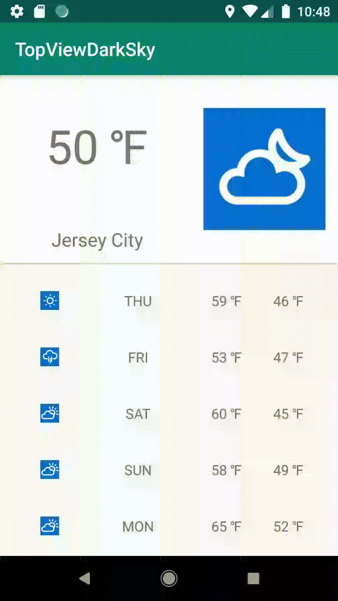

An Android app implements MVVM architecture using LocationManager, LiveData, Room, Data Binding, Retrofit and RecyclerView. 

In order to run this app, it requires a Secret Key for the API. Go to https://darksky.net/dev/register and get a Secret Key. After this repository is cloned, a gradle.properties file should be added in the Gradle.Scripts folder in Android Studio. Then add API_KEY = "Your Secret Key" in this format to the gradle.properties file. Then run the app, user will get the weather info based on the location of the device.

